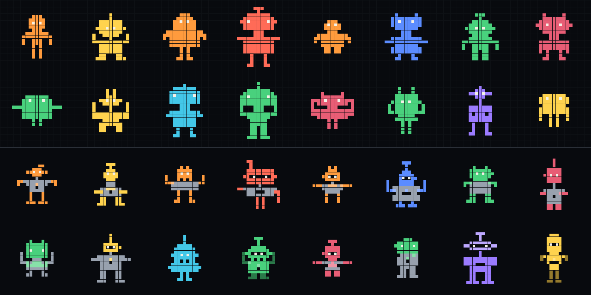

# Bitizen

[](https://github.com/kotuke/bitizen/actions/workflows/test.yml)
[](https://www.npmjs.com/package/@kotuke/bitizen)
[](LICENSE)

Deterministic pixel avatar people. The same `userId` with the same
`AVATAR_SECRET` always yields the same citizen. Generation is entirely local: no
network calls, no database, no runtime dependencies.

Two styles ship in one package, picked with the `style` option:



**[Live gallery →](https://kotuke.github.io/bitizen/)** — 50 avatars per style.

The top two rows are `plain`, the bottom two are `rich`.

| | `plain` | `rich` |
| --- | --- | --- |
| Background | plain black | plain black |
| Color | a single paint for the whole figure | 5 color schemes plus second-color trim |
| Body | solid | cutouts: visor, mouth, chest slot |
| Symmetry | always mirrored | about half of the figures are asymmetric |
| Eyes | always white | always white |
| Variants | ~4·10⁷ | ~10⁹ |

What both styles share: the figure is one connected shape built from square
modules, the eyes are always white and identical, and the seed comes from
HMAC-SHA-256, so the raw `userId` never reaches the image.

## What varies

| Part | `plain` | `rich` |
| --- | --- | --- |
| Head | width `5…9`, height `3…5`, 4 shapes | same plus a crest, 5 shapes |
| Ears | none or both sides | none, both, left only, right only |
| Antenna | none, rod, pair, rod with a crossbar | same plus a single side rod, length `1…3` |
| Neck | height `0…2`, width `1` or `3` | same |
| Torso | width `5…9`, height `3…5`, 3 shapes, shoulders | same |
| Arms | 4 styles, length `2…4` | same; the sides differ in 20% of cases |
| Legs | height `2…4`, width `1…2`, feet | same plus feet on both sides |
| Cutouts | — | visor, 3 mouth variants, chest slot |
| Trim | — | belt, chest panel, pauldrons |
| Color | 12 accents | 12 accents × 5 schemes |

In `rich`, cutouts are applied one at a time and rolled back if they would split
the figure, so a bot always stays a single connected shape.

### `rich` color schemes

| Scheme | Result |
| --- | --- |
| 0 | mono: the whole figure in the accent |
| 1 | head, ears and antenna lighter than the body |
| 2 | arms and legs darker than the body |
| 3 | torso and neck neutral grey, the rest in the accent |
| 4 | only the head in the accent, the rest neutral grey |

## Install

```bash
npm install @kotuke/bitizen
```

Two styles ship in one package; pick one with the `style` option. Node.js 20 or newer; the package has no runtime
dependencies. A browser-only entry point is available as
`@kotuke/bitizen/browser` — it renders SVG without `node:crypto` or `zlib`.

## Quick start

Node.js 20 or newer is required.

```bash
AVATAR_SECRET='replace-with-a-long-random-secret' npm start
```

```text
GET http://127.0.0.1:3000/avatars/v1/user-123.png
GET http://127.0.0.1:3000/avatars/v1/user-123.png?style=rich
GET http://127.0.0.1:3000/avatars/v1/user-123.svg?size=512&style=rich
GET http://127.0.0.1:3000/health
```

Sizes are `32…2048`, default `256`. Style is `plain` (default) or `rich`; an
unknown style returns `400`. The `ETag` includes the style, so the two styles
never share a cache entry.

## Why a secret

The avatar is a function of `userId`. Without a secret that function is fully
predictable: anyone who knows the algorithm can render an avatar for a guessed
identifier and compare it with what your site serves, which turns the avatar into
an oracle for "does this email have an account here?". Keying the hash with
`AVATAR_SECRET` keeps the image deterministic for you and unreproducible for
everyone else, and lets you rotate the whole avatar set at once if you ever need
to. Keep the secret on the backend: never ship it to the client, never put it in
a URL.

## Use as a module

```js
import { generateAvatarPng, generateAvatarSvg } from "@kotuke/bitizen";

const options = { secret: process.env.AVATAR_SECRET, size: 256 };

const plain = generateAvatarPng("user-123", options);
const rich = generateAvatarPng("user-123", { ...options, style: "rich" });
const svg = generateAvatarSvg("user-123", { ...options, style: "rich" });
```

When both formats are needed, compute the descriptor once:

```js
import {
  createAvatarDescriptor,
  renderAvatarPng,
  renderAvatarSvg,
} from "@kotuke/bitizen";

const bot = createAvatarDescriptor("user-123", {
  secret: process.env.AVATAR_SECRET,
  style: "rich",
});

const svg = renderAvatarSvg(bot, { size: 256 });
const png = renderAvatarPng(bot, { size: 256 });
```

A descriptor always carries its own `style`; the renderer is chosen from it, and
a descriptor from the wrong style is rejected before any XML is written. The two
shapes differ:

```js
// style: "plain"
{ version, fingerprint, accent, pixels: [[column, row], …], eyes, rows, style }

// style: "rich"
{ version, fingerprint, accent, scheme, layers: [{ color, pixels }, …], eyes, rows, columns, style }
```

## CLI

```bash
AVATAR_SECRET='replace-with-a-long-random-secret' \
  node src/cli.mjs --id user-123 --out bot.png --format png --size 512 --style rich
```

## Checks and examples

```bash
npm test        # 40 tests: both styles, the facade and HTTP
npm run preview # rebuild preview.png
npm run docs    # rebuild the GitHub Pages gallery in docs/
npm run sample  # 12 examples per style into examples/generated/
npm run benchmark
npm run collision
```

Measured on the machine this package was built on:

| Style | SVG 256px | PNG 256px | Repeats per 100,000 |
| --- | --- | --- | --- |
| `plain` | 0.20 ms | 0.84 ms | 26 |
| `rich` | 0.29 ms | 1.01 ms | 0 |

## Stability contract

An avatar is defined by four inputs:

```text
AVATAR_VERSION + AVATAR_SECRET + style + userId
```

Do not change `AVATAR_SECRET` if existing avatars must stay the same. Switching
the style of an already registered user also changes their picture. When the
algorithm changes, bump `AVATAR_VERSION` and serve a new URL such as
`/avatars/v2/...` — that invalidates long-lived CDN caches correctly.

Prefer an existing public UUID or a separate opaque `avatarKey` in the URL rather
than an email address or a phone number.

## Uniqueness

A visual collision is theoretically possible, as with any finite identicon. If
your product needs strict uniqueness, store the visual signature at registration
and, on a clash, append a stable `avatarVariant` to the input identifier, for
example `${user.id}:${user.avatarVariant}`.

## Origin

Grown out of [bitling](https://github.com/kotuke/bitling), where everyone
shared the same white robot and only the sigil above it was personal. Bitizen
drops the sigil and makes the figure itself personal.

## Using with an AI assistant

[`llms.txt`](llms.txt) is a compact, machine-readable summary of the whole API —
options, error behaviour, descriptor shape and the determinism contract. Point an
assistant at `https://kotuke.github.io/bitizen/llms.txt` (or paste the file) and it
has everything needed to wire the library up correctly without reading the source.

## Contributing

Pull requests are welcome. Before sending one:

```bash
npm ci
npm run lint
npm test
```

Formatting follows `.editorconfig` (two spaces, LF, UTF-8), and the code style
is whatever the surrounding file already does. If a change affects the generated
figures, say so explicitly in the PR — avatars are a stability contract, and the
same `userId` is expected to keep its picture.

## License

MIT — see [LICENSE](LICENSE).
